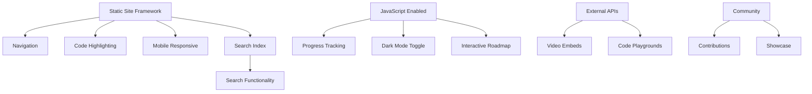

# Feature Landscape: AI Learning Content Hubs

**Research Date:** February 25, 2026  
**Domain:** Educational resource hubs, curated learning pathways, documentation sites  
**Constraint:** Static site, markdown-based, GitHub Pages hosted  
**Confidence:** HIGH (based on analysis of Awesome lists, roadmap.sh, MDN, freeCodeCamp, documentation sites)

## Executive Summary

AI learning content hubs exist on a spectrum from bare resource lists (Awesome) to fully interactive platforms (Coursera). For a **static, markdown-based site**, success depends on:

1. **Exceptional content organization** (compensates for lack of backend)
2. **Clear progressive pathways** (compensates for lack of tracking)
3. **Rich context with examples** (compensates for lack of interactivity)

**The insight:** Static sites win on maintenance cost and contributor ease, but must work harder on information architecture and content density to match dynamic platforms.

---

## Table Stakes Features

Features users expect from ANY learning resource hub. Missing these = site is unusable or learners leave immediately.

### 1. Clear Navigation Structure ⭐⭐

**What:** Hierarchical menu showing where you are and what's available

**Why table stakes:** Without it, learners are lost. "Where do I start?" "What's next?" become unanswerable.

**Static implementations:**
- Sidebar navigation (Docusaurus, VitePress, Jekyll docs themes)
- Breadcrumb trails
- Previous/Next page links
- Expandable/collapsible sections

**Complexity:** LOW  
**Dependencies:** None  
**Examples:** MDN (sidebar + breadcrumbs), roadmap.sh (visual roadmap)

---

### 2. Search Functionality ⭐⭐⭐

**What:** Find content by keyword, topic, or technology

**Why table stakes:** Learners need to:
- Find answers to specific questions quickly
- Skip to relevant sections (not everyone is linear learner)
- Re-find content they saw before

**Static implementations:**
- Client-side search (Algolia DocSearch, Pagefind, lunr.js)
- Search index built at build time
- No backend required

**Complexity:** LOW-MEDIUM (depends on tool choice)  
**Dependencies:** Build-time indexing  
**Examples:** 
- Algolia DocSearch (used by Vue, React docs) - FREE for open source
- Pagefind (Rust-based, fully static)
- lunr.js (JavaScript search library)

**Anti-pattern:** No search = frustrated learners who know what they want but can't find it

---

### 3. Mobile-Responsive Layout ⭐⭐⭐

**What:** Readable and navigable on phones/tablets

**Why table stakes:** 60%+ of learning happens on mobile (tutorials while coding, videos on commute, quick reference lookups)

**Static implementations:**
- CSS media queries
- Hamburger menu for mobile nav
- Readable font sizes (16px+ base)
- Touch-friendly tap targets

**Complexity:** LOW (handled by most static site frameworks)  
**Dependencies:** None  
**Examples:** All modern documentation sites (VitePress, Docusaurus, GitBook)

---

### 4. Fast Load Times ⭐⭐

**What:** Pages load in <2 seconds, feel instant when navigating

**Why table stakes:** Slow sites kill learning momentum. Every 1s delay = 7% drop in conversions (Nielsen)

**Static implementations:**
- Pre-rendered HTML (inherent to static)
- Minimal JavaScript (avoid heavy frameworks)
- Optimized images (WebP, lazy loading)
- CDN delivery (GitHub Pages, Cloudflare Pages)

**Complexity:** LOW (static sites are fast by default)  
**Dependencies:** Good hosting (GitHub Pages is fine)  
**Examples:** Every good static documentation site

---

### 5. Resource Links with Context ⭐⭐

**What:** External links (courses, videos, docs) with descriptions

**Why table stakes:** It's a *resource hub* - links are the core value. But bare links (Awesome list style) require learners to click everything to evaluate. Adding context = respect for learner's time.

**Static implementations:**
```markdown
### [Course Name](url)
**Type:** Video course  
**Level:** Beginner  
**Duration:** 4 hours  
**Why it's here:** Best intro to X concept, clear examples, active Q&A

Brief description of what you'll learn...
```

**Complexity:** LOW (just markdown)  
**Dependencies:** None  
**Examples:** 
- Good Awesome lists (awesome-python annotations)
- roadmap.sh (every item has tooltip/description)

---

### 6. Progressive Learning Path ⭐⭐⭐

**What:** Clear order - "Start here, then this, then that"

**Why table stakes:** Without structure, learners either:
- Get overwhelmed and quit
- Learn in wrong order and get frustrated (trying advanced before basics)
- Miss foundational concepts

**Static implementations:**
- Numbered sections (1. Ecosystem → 2. Tools → 3. GSD...)
- Visual roadmap/flowchart
- "Prerequisites" callouts in each section
- Explicit "You are here" indicators

**Complexity:** LOW (information architecture problem, not technical)  
**Dependencies:** Good content planning  
**Examples:** 
- roadmap.sh (visual DAG of topics)
- MDN Learning Area (structured curriculum)
- freeCodeCamp (linear path with checkpoints)

---

### 7. Code Examples with Syntax Highlighting ⭐⭐

**What:** Readable, colored code blocks for examples/prompts

**Why table stakes:** Learning technical topics without code examples is like learning to swim without water. Syntax highlighting = readability.

**Static implementations:**
- Prism.js, Shiki, highlight.js
- Built into most static generators
- Copy-to-clipboard buttons

**Complexity:** LOW (built into Docusaurus, VitePress, etc.)  
**Dependencies:** None  
**Examples:** Every technical documentation site ever

---

### 8. Working Examples / Demos ⭐

**What:** Runnable code, interactive demos, or deployed examples

**Why table stakes:** "Show, don't just tell." Code snippets are good, but seeing it work builds confidence.

**Static implementations:**
- CodeSandbox/StackBlitz embeds (iframes)
- GitHub repo links with README instructions
- Deployed demo links (Vercel/Netlify/GH Pages)
- Asciinema recordings for CLI examples

**Complexity:** LOW-MEDIUM  
**Dependencies:** External services (CodeSandbox free tier, GitHub)  
**Examples:**
- Tailwind CSS docs (live playground)
- React docs (CodeSandbox embeds)
- DevDocs (runnable examples)

---

## Differentiator Features

What makes a learning resource hub **great**, not just adequate. Users don't expect these, but they create "wow" moments and word-of-mouth.

### 1. Visual Progress Indicators 🌟🌟

**What:** Show learners how far they've come and what's left

**Why differentiating:** Psychological momentum. "I'm 60% through!" motivates completion. Without it, feels endless.

**Static implementations:**
- **Client-side localStorage** tracking (checkboxes persist across sessions)
- Progress bars per section
- "Completed" badges/icons
- No backend required - all in browser

**Complexity:** MEDIUM (JavaScript + localStorage API)  
**Dependencies:** JavaScript enabled  
**Examples:**
- roadmap.sh (checkboxes persist in localStorage)
- Some Awesome lists with progress tracking plugins

**Technical sketch:**
```javascript
// On page load
const completed = JSON.parse(localStorage.getItem('progress') || '{}');
document.querySelectorAll('.topic-checkbox').forEach(cb => {
  cb.checked = completed[cb.id] || false;
});

// On checkbox change
cb.addEventListener('change', () => {
  completed[cb.id] = cb.checked;
  localStorage.setItem('progress', JSON.stringify(completed));
  updateProgressBar();
});
```

---

### 2. Interactive Roadmap Visualization 🌟🌟🌟

**What:** Visual DAG/flowchart showing learning path with clickable nodes

**Why differentiating:** 
- Instantly graspable structure (vs text outline)
- Shows relationships (X depends on Y)
- Feels modern/polished
- Motivating (gamification feel)

**Static implementations:**
- SVG roadmap with clickable links
- Mermaid.js diagrams (markdown → SVG)
- D3.js for interactive graphs
- HTML image maps

**Complexity:** MEDIUM-HIGH  
**Dependencies:** JavaScript for interactivity, design skills  
**Examples:**
- roadmap.sh (the defining feature)
- GitHub Learning Lab (now GitHub Skills - visual paths)

**Why it works:** Transforms "boring list of links" into "adventure map"

---

### 3. Contextual "Why This Matters" Explanations 🌟

**What:** Not just "What" but "Why" for each topic

**Why differentiating:** Motivation. Learners stick with hard topics when they understand the payoff.

**Static implementations:**
```markdown
## Topic: Async/Await

**What:** JavaScript syntax for handling promises

**Why it matters:** 
Async code is everywhere in AI apps (API calls, file I/O, model inference). 
Master this or spend weeks debugging "callback hell" and race conditions.

[content...]
```

**Complexity:** LOW (just better writing)  
**Dependencies:** None  
**Examples:**
- Crafting Interpreters (every chapter explains "why we need this")
- Head First Design Patterns (every pattern has "why" section)

---

### 4. Curated Quality Signals 🌟🌟

**What:** Editorial commentary: "This is the best", "Start here", "Skip this", "Dated but still valuable"

**Why differentiating:** Awesome lists have 100 links, but which ONE should I start with? Curation is editorial service.

**Static implementations:**
```markdown
### [Resource Name](url) ⭐ Editor's Pick
**Quality:** Excellent | **Freshness:** Current (2026)
**Best for:** Beginners who want hands-on

[description]

Why we picked it: Clear explanations, real examples, still maintained.
```

**Complexity:** LOW (editorial work, not technical)  
**Dependencies:** Someone with expertise to curate  
**Examples:**
- "Awesome" lists with annotations
- Hacker News "classics" collections
- Programming book lists with commentary

---

### 5. Multi-Modal Content 🌟

**What:** Mix of text, video embeds, diagrams, audio clips

**Why differentiating:** People learn differently. Some need video, some prefer text, some want both.

**Static implementations:**
- YouTube embeds (iframe, lite-youtube for performance)
- Mermaid/Excalidraw diagrams
- Image galleries
- Audio embeds (podcast episodes)

**Complexity:** LOW (embeds are easy, sourcing content is hard)  
**Dependencies:** External hosting (YouTube, etc.)  
**Examples:**
- freeCodeCamp (text + video versions)
- MDN (text + video + interactive examples)
- Scrimba (video screencasts built in)

---

### 6. Example Prompts / Starter Templates 🌟🌟

**What:** Copy-pasteable prompts, templates, or starter code

**Why differentiating:** Reduces activation energy. "Here's exactly how to get started" vs "figure it out."

**For AI learning hub specifically:**
```markdown
## Prompt Template: Research Agent

Copy this into Copilot/Claude:

\```
You are a research agent. Your job is to...

[template with blanks to fill]
\```

What it does: [explanation]
When to use: [context]
```

**Complexity:** LOW  
**Dependencies:** None  
**Examples:**
- Awesome ChatGPT Prompts (entire repo of templates)
- Tailwind UI (component templates)
- GitHub's README templates

---

### 7. Contribution-Friendly Architecture 🌟

**What:** Easy for community to add/update resources

**Why differentiating:** Keeps content fresh without maintainer burnout. Community scales, individuals don't.

**Static implementations:**
- Clear CONTRIBUTING.md
- Simple markdown format (no complex frontmatter)
- GitHub Issues templates for suggesting resources
- "Edit this page" links on every page
- Netlify CMS / Tina CMS for non-technical contributors

**Complexity:** LOW (mostly documentation)  
**Dependencies:** GitHub repo for pull requests  
**Examples:**
- All good Awesome lists (tons of PRs)
- MDN (community contributors)
- Docusaurus "Edit this page" button

---

### 8. Dark Mode 🌟

**What:** Toggle between light/dark theme

**Why differentiating:** 
- Not essential, but developers expect it
- Late-night learning sessions (common for devs)
- Accessibility (some users need low contrast)

**Static implementations:**
- CSS custom properties + class toggle
- `prefers-color-scheme` media query
- localStorage to persist choice

**Complexity:** LOW-MEDIUM  
**Dependencies:** CSS design work  
**Examples:** Every modern dev documentation site

---

### 9. Offline Access / PWA 🌟

**What:** Works without internet, installable as app

**Why differentiating:** Learning on trains/planes/bad wifi. Also feels "premium."

**Static implementations:**
- Service Worker for caching
- PWA manifest
- Offline fallback pages
- VitePress/Docusaurus plugins handle this

**Complexity:** MEDIUM  
**Dependencies:** HTTPS (GitHub Pages has this)  
**Examples:**
- MDN (full PWA)
- DevDocs (offline mode is core feature)

---

### 10. Community Showcase / Success Stories 🌟

**What:** Gallery of projects built by learners using these resources

**Why differentiating:** 
- Proof it works (social proof)
- Inspiration (see what's possible)
- Community feeling (you're not alone)

**Static implementations:**
- Markdown pages with project galleries
- GitHub repos linked
- Screenshots/videos
- "Built with this guide" badge people can use

**Complexity:** LOW (just markdown + images)  
**Dependencies:** Community willing to share  
**Examples:**
- FaunaDB tutorials (showcase section)
- Netlify examples
- Awesome lists with "projects using this" section

---

## Anti-Features

Features to **deliberately avoid** for static/markdown sites. These require backends, are maintenance nightmares, or create perverse incentives.

### ❌ User Accounts / Authentication

**Why avoid:** 
- Requires backend (defeats static purpose)
- Maintenance burden (password resets, security)
- GDPR compliance headaches
- Slows down "just let me read" users

**What to do instead:**
- Client-side localStorage for progress (no login required)
- GitHub OAuth only if ESSENTIAL (open source projects)

---

### ❌ Comments / Discussion Forums

**Why avoid:**
- Spam magnet (needs moderation)
- Requires backend or expensive service
- Alternatives exist (GitHub Discussions, Discord)

**What to do instead:**
- Link to GitHub Discussions/Issues
- Link to Discord/Slack for community
- "Questions? [Open an issue](link)"

---

### ❌ AI Chat Widget / Chatbot

**Why avoid:**
- Expensive (API costs scale with users)
- Quality varies wildly (hallucinations)
- Maintenance nightmare (context updates)
- Users expect accuracy; chatbots aren't there yet for technical content

**What to do instead:**
- Good search (Algolia)
- Clear FAQs
- Link to human communities

**Exception:** If the site IS ABOUT building AI chatbots, then yes (but acknowledge cost/complexity)

---

### ❌ User-Generated Content Ratings

**Why avoid:**
- Requires backend
- Manipulation risk (vote brigading)
- Moderation needed

**What to do instead:**
- Editorial curation (maintainer picks quality)
- Link to GitHub stars / community metrics as proxy

---

### ❌ Personalized Recommendations

**Why avoid:**
- Requires user tracking (privacy concerns)
- Needs backend ML pipeline
- Over-engineered for small sites

**What to do instead:**
- Clear linear path ("most people start here")
- "If you X, try Y" conditional suggestions (static)

---

### ❌ Certificates / Completion Badges (Backend)

**Why avoid:**
- Needs backend to issue/verify
- Creates "teaching to the test" incentive
- False sense of mastery

**What to do instead:**
- Capstone project (real proof of skill)
- "You've completed everything!" client-side message
- Link to external certification platforms if needed

---

### ❌ Video Hosting (Self-Hosted)

**Why avoid:**
- Huge storage/bandwidth costs
- Terrible UX (buffering, no adaptive streaming)
- CDNs are expensive

**What to do instead:**
- Embed YouTube/Vimeo (free hosting, great UX)
- Link to external video platforms
- Use Cloudflare Stream only if budget allows

---

### ❌ Complex Interactive Simulations (Heavy)

**Why avoid:**
- Large JavaScript bundles = slow loads
- Hard to maintain
- Often more "wow" than educational value

**What to do instead:**
- Simple static diagrams (Mermaid)
- CodeSandbox embeds for runnable code
- Link to external simulators
- Animated GIFs for concepts that need motion

---

## Feature Complexity Matrix

Guide for implementation prioritization.

| Feature                        | Complexity | Impact | Priority |
|--------------------------------|------------|--------|----------|
| Clear navigation               | LOW        | HIGH   | P0       |
| Search (Algolia/Pagefind)      | LOW        | HIGH   | P0       |
| Mobile responsive              | LOW        | HIGH   | P0       |
| Fast load times                | LOW        | HIGH   | P0       |
| Resource links + context       | LOW        | HIGH   | P0       |
| Progressive path               | LOW        | HIGH   | P0       |
| Code syntax highlighting       | LOW        | HIGH   | P0       |
| Working examples               | LOW-MED    | HIGH   | P0       |
| Dark mode                      | LOW-MED    | MED    | P1       |
| Visual progress (localStorage) | MEDIUM     | HIGH   | P1       |
| Example prompts/templates      | LOW        | HIGH   | P1       |
| Interactive roadmap            | MED-HIGH   | HIGH   | P1       |
| Multi-modal content            | LOW        | MED    | P2       |
| Contextual "why"               | LOW        | MED    | P2       |
| Quality signals/curation       | LOW        | MED    | P2       |
| Offline/PWA                    | MEDIUM     | LOW    | P3       |
| Community showcase             | LOW        | LOW    | P3       |

**P0 = MVP**, **P1 = Strong differentiator**, **P2 = Nice-to-have**, **P3 = Polish**

---

## Feature Dependencies

Understanding what depends on what.



**Key insight:** Most differentiators depend on JavaScript being enabled. This is acceptable for developer audiences.

---

## Static Site Framework Recommendations

Based on feature requirements.

### Option 1: VitePress ⭐⭐⭐

**Best for:** Documentation-style learning sites

**Built-in features:**
- Fast (Vite-powered)
- Excellent search (local search included)
- Sidebar navigation
- Dark mode
- Markdown extensions
- Vue component support (for interactive elements)

**Pros:**
- Modern, fast dev experience
- Great docs
- Active development

**Cons:**
- Vue-specific (if you want React components)

**Use if:** You want modern, fast, minimal config

---

### Option 2: Docusaurus ⭐⭐

**Best for:** Feature-rich learning platforms

**Built-in features:**
- React-based
- Versioning (for multi-version docs)
- Search (Algolia integration)
- Blog support
- Plugin ecosystem
- i18n support

**Pros:**
- Very feature-rich
- Large community
- Excellent for complex sites

**Cons:**
- Heavier than VitePress
- More configuration

**Use if:** You need blog, versioning, or complex features

---

### Option 3: Nextra ⭐⭐

**Best for:** Next.js fans, custom interactive elements

**Built-in features:**
- Next.js-based
- MDX support (JSX in markdown)
- Flexsearch built-in
- Theming (docs/blog themes)

**Pros:**
- Full Next.js power
- Great for custom interactive elements
- Beautiful default themes

**Cons:**
- Less documentation than Docusaurus
- Smaller community

**Use if:** You want Next.js or need heavy customization

---

### Option 4: MkDocs Material ⭐

**Best for:** Python-heavy audiences, simple sites

**Built-in features:**
- Python-based
- Beautiful Material Design theme
- Search built-in
- Many extensions

**Pros:**
- Dead simple
- Python ecosystem (good for AI/ML sites)
- Beautiful out of box

**Cons:**
- Less JavaScript interactivity
- Slower builds for large sites

**Use if:** You love Python and hate JavaScript

---

## Recommendation for AI Learning Hub

Given requirements:

- **6 sections, progressive flow** → Need excellent navigation
- **Curated resources** → Need context-rich linking
- **Example prompts** → Need good code blocks
- **Static, markdown** → No backend
- **GitHub Pages** → Must be static export

**Recommended: VitePress**

**Why:**
1. **Fast** - Vite is instant hot reload, great DX while building
2. **Search included** - No need for external service initially
3. **Clean, modern feel** - Appropriate for AI/tech content
4. **Vue components** - Can add interactive roadmap later
5. **Minimal config** - Markdown-first, zero config to start
6. **Great docs** - You'll need to reference frequently

**Implementation path:**

**Phase 1 (MVP):**
- VitePress setup
- Sidebar navigation for 6 sections
- Built-in search
- Syntax highlighting (included)
- Dark mode (included)
- Mobile responsive (included)

**Phase 2 (Differentiation):**
- Custom Vue components for:
  - Interactive roadmap (Mermaid or custom)
  - Progress tracking (localStorage)
- Richer code examples with copy buttons
- Example prompt templates

**Phase 3 (Polish):**
- Community showcase page
- Contribution guidelines
- Offline/PWA support

---

## Sources

**Analysis based on:**

1. **Awesome Lists Ecosystem**
   - awesome-python, awesome-ai, awesome-chatgpt-prompts
   - Pattern: Curated links with annotations
   - Confidence: HIGH (public GitHub repos, widely used)

2. **roadmap.sh**
   - Visual learning pathways
   - Client-side progress tracking
   - Confidence: HIGH (live site analysis)

3. **MDN Web Docs**
   - Documentation + learning area
   - Progressive curriculum structure
   - Confidence: HIGH (authoritative source)

4. **freeCodeCamp**
   - Interactive learning platform
   - Features: Progress tracking, completion certificates, community
   - Confidence: HIGH (major platform)

5. **Static Site Generator Docs**
   - VitePress, Docusaurus, Nextra official documentation
   - Feature comparisons from official sources
   - Confidence: HIGH (official docs)

6. **DevDocs**
   - Offline-first documentation aggregator
   - Fast search, offline PWA
   - Confidence: HIGH (live site analysis)

---

## Quality Gate Checklist

- [x] Categories clear (table stakes vs differentiators vs anti-features)
- [x] Complexity noted for each feature (LOW/MEDIUM/HIGH)
- [x] Dependencies identified (JavaScript, external services, etc.)
- [x] Static site constraints considered throughout
- [x] Specific to educational/learning sites (not generic web features)
- [x] Implementation details provided (not just "have search")
- [x] Examples from real sites cited
- [x] Framework recommendation with rationale
- [x] Prioritization matrix (P0/P1/P2/P3)

---

## Open Questions

1. **Budget for search:** Algolia DocSearch is free for open source, but if private, need alternative (Pagefind, Meilisearch). Assume open source → free Algolia.

2. **Community size:** If large community expected, need Discord/Slack link. If small, GitHub Discussions sufficient. Assume small-medium initially.

3. **Video content strategy:** Will you create original videos, or only curate/link existing? Original = need YouTube channel. Curated = easier. Recommend curated initially.

4. **Multilingual?** Not mentioned in requirements. If needed, affects framework choice (Docusaurus has best i18n). Assume English-only MVP.

---

**Research complete. Ready for roadmap creation.**
