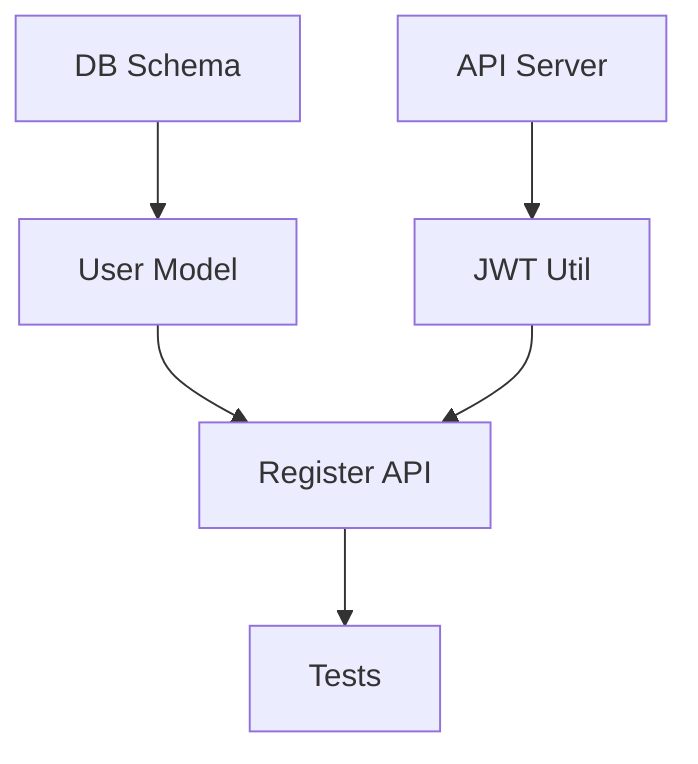

# 3. GSD Framework

## Table of Contents

- [Overview](#overview)
- [GSD Framework Overview](#gsd-framework-overview)
- [Goal → Spec → Deliver Flow](#goal--spec--deliver-flow)
- [PRD-Driven Execution](#prd-driven-execution)
- [Task Decomposition](#task-decomposition)
- [Resources](#resources)
- [Navigation](#navigation)

## Overview

The GSD (Goal → Spec → Deliver) Framework represents a systematic approach to AI-assisted software development that bridges the gap between high-level vision and executable implementation. It's designed to maximize AI agent effectiveness while maintaining human control over strategic decisions.

This section teaches you a proven workflow for translating ideas into shipped software using AI agents as force multipliers. Rather than ad-hoc prompting and hoping for good results, GSD provides a repeatable structure that consistently produces quality outcomes.

By mastering GSD, you'll gain confidence in delegating significant portions of development work to AI while ensuring alignment with your vision, catching issues early, and maintaining architectural coherence across complex projects.

## GSD Framework Overview

### The GSD Philosophy

The GSD Framework is built on a simple but powerful philosophy: **separate strategic thinking (what to build) from tactical execution (how to build it)**.

**Core Principles:**

**1. Humans Define Goals, AI Executes Specs**

You excel at:
- Understanding business problems
- Setting priorities
- Making architectural decisions
- Evaluating tradeoffs

AI excels at:
- Generating boilerplate code
- Following detailed specifications
- Finding implementation patterns
- Maintaining consistency

**The Framework:**
```
Human → Goal (What & Why)
  |
  v
Human + AI → Spec (How, broken down)
  |
  v
AI + Human → Deliver (Implementation)
```

**2. Structure as Scaffolding**

AI has weaknesses:
- Context amnesia (forgets across sessions)
- Scope creep (tends to over-build)
- Inconsistency (different approaches each time)

Structure compensates by:
- **Written Goals:** Persistent reference AI can always review
- **Detailed Specs:** Clear boundaries preventing scope expansion
- **Verification Checkpoints:** Catching inconsistencies early

**3. AI as Capable Collaborator, Not Autopilot**

The right mental model:
```
✓ AI is a skilled junior developer with:
  - Excellent technical knowledge
  - Fast execution speed
  - Needs clear direction
  - Benefits from oversight

✗ AI is NOT:
  - Magic that reads your mind
  - Capable of unsupervised strategic decisions
  - Reliable without verification
```

**The Philosophy in Practice:**

Instead of:
```
❌ "Build a task management app"
   → Vague, AI guesses at requirements
   → Results don't match your vision
   → Lots of back-and-forth fixing
```

GSD approach:
```
✅ Goal: "Task management app for freelancers to track 
          client projects with time tracking"
✅ Spec: [15 specific, ordered tasks with acceptance criteria]
✅ Deliver: AI implements each task, you verify
   → Aligned with vision
   → Predictable progress
   → Efficient execution
```

### Why Traditional Approaches Fall Short

**The "Just Ask AI" Approach**

Many developers try ad-hoc AI usage:
```
1. Have idea
2. Prompt AI: "Build X"
3. Get something
4. Realize it's not quite right
5. Try again with more details
6. Still not right
7. Give up or spend hours fixing
```

**Common Pitfalls:**

**1. Scope Creep**

```
You: "Create a user login form"
AI: [Builds form + validation + API integration + 
     database schema + password reset + OAuth + 
     2FA + session management]

Result: Way more than you asked for, and now you have
        to understand/maintain all of it
```

Without clear boundaries, AI over-engineers.

**2. Inconsistent Quality**

```
Session 1: "Create user model"
→ AI uses classes with private fields

Session 2: "Create product model"  
→ AI uses plain objects with interfaces

Session 3: "Create order model"
→ AI uses factory functions

Result: Codebase has 3 different patterns for same concept
```

Without specs, AI reinvents approaches each time.

**3. Architectural Drift**

```
Week 1: AI suggests REST API
Week 2: AI adds GraphQL for one feature
Week 3: AI introduces RPC for another

Result: Fragmented architecture with 3 API styles
```

Without upfront decisions, architecture evolves randomly.

**4. Context Loss Across Sessions**

```
Monday: AI helps build feature A
Tuesday: Different prompts, AI forgets Monday's patterns
Wednesday: Different AI tool, starts from scratch

Result: Rebuild context every session = massive inefficiency
```

**5. The "Almost Right" Trap**

```
AI generates code that:
✓ Looks right
✓ Runs without errors
✗ Has subtle bugs
✗ Doesn't handle edge cases
✗ Misses security concerns

You ship it → Production issues
```

Without verification checkpoints, issues slip through.

**The Cost:**

- **Time:** Hours spent iterating on vague prompts
- **Quality:** Inconsistent patterns, technical debt
- **Frustration:** "AI doesn't understand what I want"
- **Waste:** Discarding AI-generated code that missed the mark

**Why Frameworks Matter:**

Structured approaches like GSD:

✓ **Prevent scope creep** with clear Goals
✓ **Ensure consistency** with detailed Specs
✓ **Maintain architecture** with upfront decisions
✓ **Preserve context** with written documentation
✓ **Catch issues early** with verification steps

**The Reality:**

> Without structure, AI is a very fast way to build the wrong thing.  
> With structure, AI is a force multiplier that ships quality code.

GSD provides that structure.

### The Three Phases

GSD structures development into three distinct, sequential phases. Each phase has clear inputs, outputs, and objectives.

```
┌─────────────────────────────────────────────────────────────┐
│  GOAL → SPEC → DELIVER                                      │
│                                                              │
│  What+Why  →  How (Detailed)  →  Implementation+Verification│
└─────────────────────────────────────────────────────────────┘
```

**Phase 1: GOAL - Define Success**

**Purpose:** Crystallize what you're building and why

**Inputs:**
- Your idea or problem
- Constraints (time, tech, requirements)
- Success criteria (what does done look like?)

**Activities:**
- Write clear problem statement
- Define scope boundaries (what's IN, what's OUT)
- Identify success criteria
- Document non-goals (what you're explicitly NOT building)

**Outputs:**
- Goal document: 1-2 pages capturing the "what" and "why"
- Clear definition of done
- Constraints and assumptions documented

**Example Goal:**
```markdown
# Goal: Freelancer Time Tracker

## Problem
Freelancers lose billable hours because they forget to track time.

## Solution
Simple time tracking app that:
- Starts/stops timers for tasks
- Organizes by client and project
- Generates weekly reports

## Success Criteria
✓ User can start timer in <2 clicks
✓ Export report as CSV
✓ Works offline (sync later)

## Non-Goals
✗ Not building invoicing
✗ Not building team features
✗ Not building mobile app (web only)
```

**Phase 2: SPEC - Plan Implementation**

**Purpose:** Break goal into executable tasks with technical decisions made

**Inputs:**
- Goal document from Phase 1
- Technical constraints
- Your architectural preferences

**Activities:**
- Choose tech stack
- Design data models
- Break down into tasks (15-30 tasks typical)
- Order tasks by dependencies
- Define acceptance criteria per task

**Outputs:**
- Detailed PRD (Product Requirements Document)
- Task list with dependencies
- Technical decisions documented
- Acceptance criteria for each task

**Example Spec (excerpt):**
```markdown
# Spec: Time Tracker Implementation

## Tech Stack
- Frontend: React + TypeScript + Tailwind
- Backend: Node.js + Express + SQLite
- Deploy: Vercel (frontend) + Railway (backend)

## Data Model
- Timer: id, taskName, clientId, startTime, endTime
- Client: id, name, hourlyRate

## Tasks
1. Create database schema for Clients and Timers
2. Build API: POST /timers/start
3. Build API: POST /timers/stop
4. Create TimerControl component (start/stop buttons)
5. Create TimerDisplay component (shows running time)
...
```

**Phase 3: DELIVER - Execute and Verify**

**Purpose:** Implement the spec with AI assistance and verify quality

**Inputs:**
- Complete Spec/PRD from Phase 2
- Code environment setup

**Activities:**
- Execute tasks sequentially (or parallel where possible)
- Use AI to implement each task
- Verify each task meets acceptance criteria
- Fix issues before moving to next task
- Track progress

**Outputs:**
- Working implementation
- Tested code
- Documentation
- Deployed product (if applicable)

**Example Deliver Task:**
```markdown
## Task 3: Build API POST /timers/stop

Prompt to AI:
"Create POST endpoint /api/timers/stop that:
- Accepts { timerId }
- Finds timer in database
- Sets endTime to current timestamp
- Returns updated timer object
- Returns 404 if timer not found
- Returns 400 if timer already stopped"

Verification:
✓ Endpoint exists and responds
✓ Successfully stops running timer
✓ Handles error cases correctly
✓ Tests pass
```

**Phase Interdependencies:**

```
Goal is complete when:
  ✓ Problem clearly stated
  ✓ Success criteria defined
  ✓ Scope boundaries set
  → Ready for Spec phase

Spec is complete when:
  ✓ All technical decisions made
  ✓ Tasks broken down with acceptance criteria
  ✓ Dependencies identified
  → Ready for Deliver phase

Deliver is complete when:
  ✓ All tasks implemented
  ✓ Acceptance criteria met
  ✓ Working product exists
  → Project complete!
```

**Key Insight:**

> Each phase transforms uncertainty into clarity.  
> Goal: "I think I want X" → Clear requirements  
> Spec: "Clear requirements" → Executable plan  
> Deliver: "Executable plan" → Working software

### When to Use GSD

**GSD Shines For:**

**✅ Greenfield Projects**
```
Starting from scratch with clear vision
→ GSD helps structure the journey from idea to implementation

Example: Building a new SaaS product, internal tool, or portfolio project
```

**✅ Substantial Features**
```
Adding significant functionality to existing projects
→ GSD ensures feature aligns with overall architecture

Example: Adding payment processing, multi-tenancy, or real-time collaboration
```

**✅ Refactoring Initiatives**
```
Restructuring code while preserving functionality
→ GSD breaks down complex refactor into safe, verifiable steps

Example: Migrating from REST to GraphQL, extracting microservices, updating state management
```

**✅ Learning Projects**
```
Building to learn new technologies or patterns
→ GSD provides structure that accelerates learning

Example: First React project, learning TypeScript, exploring new framework
```

**✅ Complex Problem Solving**
```
Multi-faceted problems requiring coordinated solutions
→ GSD breaks complexity into manageable pieces

Example: Building ETL pipeline, implementing search with ranking, creating recommendation engine
```

**When Lightweight Approaches Suffice:**

**⚠️ Quick Experiments**
```
Testing ideas quickly, may throw away
→ Overhead of GSD not worth it

Just use: Direct AI prompts, rapid prototyping
```

**⚠️ Tiny Changes**
```
Fix typo, update dependency, tweak styling
→ Don't need formal structure

Just use: Direct edits or quick AI assistance
```

**⚠️ Well-Worn Paths**
```
Repeating something you've done many times
→ You know exactly what to do

Just use: Your experience + AI for speed
```

**⚠️ Exploration Mode**
```
You don't know what you want yet
→ Need to explore before committing to structure

Just use: Prototypes, spikes, conversations with AI
```

**Decision Framework:**

```
Will this take more than 2 hours of development?
├─ NO → Probably don't need GSD
│         Quick prompts likely sufficient
│
└─ YES → Do you know exactly what to build?
          ├─ NO → Explore first, then GSD
          │        Prototype → Learn → Goal → Spec → Deliver
          │
          └─ YES → Use GSD
                   Structure prevents problems at scale
```

**The Threshold:**

| Project Scope | Approach | Why |
|---------------|----------|-----|
| <2 hours | Ad-hoc AI prompts | Overhead not worth it |
| 2-8 hours | Lightweight: Goal + Deliver | Some structure helps |
| 8+ hours | Full GSD | Structure pays dividends |
| Multi-week | Full GSD + phases | Essential for success |

**Pro Tip: Hybrid Approach**

You can mix:
```
1. Explore with quick prototypes (no GSD)
2. Learn what you want to build
3. Throw away prototype
4. Apply GSD to build it right
```

**Example:**
```
Exploration (2 hours):
"Just trying different UI layouts with AI"
→ Learn: Cards work better than list view

GSD (8 hours):
Goal: "Dashboard with card-based layout"
Spec: [Detailed tasks]
Deliver: Production-quality implementation
```

**Golden Rule:**

> If you'll care about the code quality tomorrow, use GSD today.

## Goal → Spec → Deliver Flow

### Goal Phase: Defining Success

Deep dive into the Goal phase: capturing requirements, identifying constraints, defining success criteria, and articulating both what you want and what you explicitly don't want. Emphasize clarity over completeness.

### Spec Phase: Planning Implementation

Explore the Spec phase: breaking down goals into concrete tasks, identifying technical approaches, sequencing work logically, and creating a roadmap that AI can execute. Discuss balancing detail with flexibility.

### Deliver Phase: Execution & Verification

Detail the Deliver phase: systematic task execution, continuous verification against specs, handling deviations, and closing the loop back to goals. Explain checkpoints, validation patterns, and iteration strategies.

### Phase Transitions

Describe how to navigate transitions between phases: when a goal is "ready" to spec, when a spec is "ready" to deliver, and how to handle discoveries that require backtracking to earlier phases.

## PRD-Driven Execution

### What is a PRD in GSD Context

**PRD = Product Requirements Document**

In traditional software development, PRDs document what to build for stakeholders and teams. In GSD/Agentic AI context, PRDs serve a dual purpose:

**1. Single Source of Truth**

The PRD becomes the canonical reference that:
- Documents decisions so they don't need to be remade
- Persists across AI sessions (solves context loss)
- Aligns all contributors (human and AI)
- Prevents scope creep with explicit boundaries

**2. AI Agent Instruction Manual**

AI agents use PRDs to:
- Understand the complete project vision
- Generate code that aligns with requirements
- Make micro-decisions within defined constraints
- Self-verify implementation against criteria

**The Shift:**

**Traditional PRD:**
```
Audience: Human developers
Purpose: Communicate what stakeholders want
Format: Business-focused, user stories
Detail Level: High-level, devs fill in technical gaps
```

**GSD/AI PRD:**
```
Audience: AI agents (+ humans)
Purpose: Enable autonomous execution
Format: Technical + business context
Detail Level: Specific enough AI doesn't guess wrong
```

**Example Difference:**

**Traditional:**
> "Users should be able to log in to the system."

**GSD/AI:**
> "Users authenticate via email/password using JWT tokens.
> - POST /auth/login endpoint accepts email + password
> - Returns JWT valid for 7 days
> - Invalid credentials return 401 with error message
> - Successful login redirects to /dashboard
> - No social auth in MVP (explicit non-goal)"

The AI version eliminates ambiguity that would cause AI to over-engineer or guess incorrectly.

**Why PRDs Matter for AI:**

**Without PRD:**
```
Session 1: AI builds login (guesses at implementation)
Session 2: AI forgets session 1 approach
Session 3: AI uses different patterns
→ Inconsistent codebase
```

**With PRD:**
```
Session 1: AI reads PRD, implements per spec
Session 2: AI reads PRD, stays consistent
Session 3: AI reads PRD, follows same patterns
→ Coherent codebase
```

**Mental Model:**

Think of PRD as:
- **Contract** between you and AI agent
- **Blueprint** AI executes from
- **Reference manual** AI consults repeatedly
- **Quality checklist** for verifying outcomes

### PRD Structure & Components

**Best-in-Class PRD Template:**

For a comprehensive, battle-tested PRD structure, see:

📄 **[Best PRD Template](https://github.com/SriSatyaLokesh/best-prd-template)**

This template has been refined through real-world usage and provides a complete framework for both human and AI collaboration.

**Core Sections of an Effective AI-Ready PRD:**

---

**1. Executive Summary**

**Purpose:** 2-3 sentence project overview

**What to Include:**
- What are you building?
- Who is it for?
- Why does it matter?

**Example:**
```markdown
## Executive Summary

A developer portfolio website that showcases projects, skills, and
contact information. Targeted at software engineers seeking employment
or freelance opportunities. Differentiates through clean design and
fast load times (< 2 seconds).
```

**Why AI Needs This:**
- Provides context for all micro-decisions
- Helps AI prioritize (e.g., "fast load times" → optimize assets)

---

**2. Goals & Non-Goals**

**Purpose:** Crystal clear boundaries

**Goals (What you WILL build):**
```markdown
## Goals

### Primary Goals
- Display 6-10 featured projects with descriptions
- Contact form with email integration
- Mobile-responsive design
- Deployed to production with custom domain

### Secondary Goals (Nice-to-have)
- Dark mode toggle
- Animated section transitions
- Blog integration (if time permits)
```

**Non-Goals (What you WILL NOT build):**
```markdown
## Non-Goals

- ❌ User authentication (not needed)
- ❌ Backend database (static site)
- ❌ Content management system
- ❌ E-commerce functionality
- ❌ Multi-language support
- ❌ Native mobile apps

Rationale: Keeping scope minimal for MVP launch in 2 weeks.
```

**Why This Section is Critical:**
- Prevents AI from over-engineering
- Stops feature creep before it starts
- AI can say "that's out of scope" when you request extras

---

**3. User Stories / Use Cases**

**Purpose:** Define user interactions

**Format:**
```markdown
## User Stories

**As a** [user type]
**I want** [goal]
**So that** [benefit]

**Acceptance Criteria:**
- [ ] Specific testable condition 1
- [ ] Specific testable condition 2
```

**Example:**
```markdown
### User Story 1: View Projects

**As a** potential employer
**I want** to browse developer's featured projects
**So that** I can assess their skills and experience

**Acceptance Criteria:**
- [ ] Projects displayed in grid layout (3 columns desktop, 1 mobile)
- [ ] Each project shows: title, description, tech stack, links
- [ ] Clicking thumbnail opens project details
- [ ] "View Code" button links to GitHub repo
- [ ] "Live Demo" button links to deployed project
- [ ] Projects load in < 1 second
```

**Why AI Needs This:**
- Provides clear implementation targets
- Acceptance criteria = verification checklist
- AI knows when feature is "done"

---

**4. Technical Requirements**

**Purpose:** Specify architecture and tech stack

**What to Include:**
- Technology choices (languages, frameworks, libraries)
- Architecture decisions (SPA vs MPA, REST vs GraphQL)
- External dependencies (APIs, services)
- Performance requirements
- Browser/device support
- Security considerations

**Example:**
```markdown
## Technical Requirements

### Tech Stack
- **Frontend:** React 18 + TypeScript + Vite
- **Styling:** Tailwind CSS
- **Deployment:** Vercel
- **Forms:** Formspree (email handling)
- **Analytics:** Plausible (privacy-focused)

### Architecture Decisions
- Single-page application (SPA) with client-side routing
- No backend server (serverless functions for contact form only)
- Static generation for fast initial load
- Code-splitting for optimal bundle size

### Performance Targets
- First Contentful Paint: < 1.5s
- Lighthouse score: > 90
- Bundle size: < 200KB gzipped

### Browser Support
- Chrome, Firefox, Safari, Edge (latest 2 versions)
- Mobile: iOS Safari 14+, Chrome Android

### Security
- HTTPS only (Vercel provides)
- Form spam protection (Formspree built-in)
- No sensitive data stored client-side
```

**Why This Matters:**
- AI understands constraints ("must use React")
- Prevents architectural drift
- Performance requirements guide optimization decisions

---

**5. Success Criteria**

**Purpose:** Define "done"

**Functional Success:**
```markdown
## Success Criteria

### Functional Requirements
- [ ] All 6 sections render correctly
- [ ] Navigation works (smooth scroll to sections)
- [ ] Contact form submits and shows confirmation
- [ ] All external links open in new tabs
- [ ] Responsive on mobile, tablet, desktop
- [ ] Works without JavaScript (progressive enhancement)
```

**Quality bar:**
```markdown
### Quality Requirements
- [ ] No console errors or warnings
- [ ] All images optimized (WebP format)
- [ ] Accessibility: WCAG AA compliant
- [ ] SEO: Meta tags, Open Graph, Twitter Card
- [ ] Performance: Lighthouse score > 90
```

**Launch Criteria:**
```markdown
### Launch Readiness
- [ ] Custom domain configured
- [ ] SSL certificate active
- [ ] Analytics tracking verified
- [ ] Tested on 5 different devices
- [ ] All placeholder content replaced
- [ ] Resume PDF uploaded and linked
```

---

**6. Constraints**

**Purpose:** Document limitations

```markdown
## Constraints

### Time
- MVP must ship within 2 weeks
- Daily time budget: 2-3 hours

### Budget
- $0/month (free tier services only)
- Vercel free tier, Formspree free tier

### Technical
- No backend server (static hosting only)
- Must work offline after initial load (PWA optional)
- Accessibility is required, not optional

### Scope
- Focus on quality over quantity of features
- 6-8 projects maximum (curated, not comprehensive)
```

**Why AI Needs Constraints:**
- Makes practical trade-offs ("no server" → client-side only)
- Respects time budget (chooses simpler implementations)
- Prioritizes correctly (accessibility required → include from start)

---

**7. Open Questions / Risks**

```markdown
## Open Questions

- Should projects filter by technology?
  - Decision: Not in MVP, add if user feedback requests

- Dark mode: auto-detect or toggle?
  - Decision: Toggle in header, respect system preference as default

## Risks

| Risk | Mitigation |
|------|------------|
| Contact form spam | Use Formspree's built-in spam protection |
| Slow image loading | Lazy load below fold, optimize all images |
| Browser compatibility | Test on BrowserStack early |
```

**Using the PRD:**

Every AI prompt should reference the PRD:
```
"According to our PRD (see PROJECT.md), implement the contact
form section following the technical requirements (React + TypeScript)
and meeting the success criteria (form validation, confirmation message)."
```

### Writing PRDs for AI Agents

**AI-Assisted PRD Creation:**

You don't have to write PRDs alone! Modern AI tools have built-in skills for PRD generation:

**🤖 GitHub Copilot + Awesome-Copilot Extension:**
- Install: [awesome-copilot VS Code extension](https://marketplace.visualstudio.com/items?itemName=mohitmishra.awesome-copilot)
- Includes PRD writing templates and patterns
- Helps structure requirements and technical specs
- Suggests acceptance criteria based on user stories

**🧠 Claude Code (Claude Sonnet 4.5):**
- Has deep understanding of PRD best practices
- Can critique and improve your PRD drafts
- Excellent at identifying gaps or ambiguities
- Helps break down high-level goals into detailed specs

**Prompt Pattern for PRD Generation:**

```markdown
**To Claude/Copilot:**

I need to create a PRD for [project brief].

Follow this structure:
1. Executive Summary
2. Goals & Non-Goals
3. User Stories with Acceptance Criteria
4. Technical Requirements
5. Success Criteria
6. Constraints

My project: [describe in 2-3 sentences]

Key requirements:
- [Requirement 1]
- [Requirement 2]
- [Requirement 3]

Generate a comprehensive PRD following best practices.
```

**Guidelines for Effective AI-Ready PRDs:**

**1. The Detail Sweet Spot**

**Too Vague:**
```markdown
❌ "Build a good user experience"
```

**Too Specific:**
```markdown
❌ "Use #3B82F6 for the primary button background with
    2px border radius and 0.3s cubic-bezier(0.4, 0, 0.2, 1)
    transition on the transform property when hovering"
```

**Just Right:**
```markdown
✅ "Primary buttons use blue color scheme (Tailwind blue-500)
    with subtle hover animation. Maintain accessibility contrast
    standards (WCAG AA minimum)."
```

**The Rule:**
- Specify **what** and **why**
- Let AI determine **how** (within constraints)
- Provide examples when patterns matter

---

**2. Structure for Sequential Reading**

AI reads PRDs top-to-bottom. Structure accordingly:

**Good Order:**
```
1. Executive Summary (context)
2. Goals & Non-Goals (boundaries)
3. User Stories (what to build)
4. Technical Requirements (how to build)
5. Success Criteria (definition of done)
6. Constraints (limitations)
```

Each section builds on previous ones.

**In Practice:**
- AI reads "Goals" → understands scope
- AI reads "Non-Goals" → won't over-engineer
- AI reads "Technical Requirements" → uses right tools
- AI reads "Success Criteria" → knows when done

---

**3. Call Out Ambiguities Explicitly**

**Instead of leaving AI to guess:**
```markdown
❌ "Implement user authentication"
```

**Be explicit about what's decided vs open:**
```markdown
✅ "Implement user authentication:
    
    Decided:
    - Email + password (no social auth in MVP)
    - JWT tokens with 7-day expiry
    - Bcrypt for password hashing
    
    Open (AI choose):
    - Which JWT library (jose, jsonwebtoken, etc.)
    - Database table structure (optimize as needed)
    - Specific field validation patterns"
```

**Pattern:**
```markdown
### [Feature Name]

**Hard Requirements:**
- [Must-have 1]
- [Must-have 2]

**Preferences:**
- [Nice-to-have 1]
- [Nice-to-have 2]

**Open to AI:**
- [Decision AI can make]
- [Implementation detail AI chooses]

**Explicitly Out:**
- [Thing not to include]
```

---

**4. Provide Examples of Desired Outcomes**

**Abstract Requirements:**
```markdown
✗ "Create a clean, modern card layout"
```

**Concrete Examples:**
```markdown
✓ "Create card components similar to GitHub repository cards:
   - Title + description + metadata row
   - Subtle border, shadow on hover
   - Consistent spacing (padding: 1.5rem)
   
   Reference: https://github.com/explore
   
   Or provide design mockup: see design/cards.png"
```

**Types of Examples:**

**Code Examples:**
```markdown
"Folder structure should follow this pattern:

src/
├── components/
│   ├── Button/
│   │   ├── Button.tsx
│   │   ├── Button.test.tsx
│   │   └── index.ts
│   └── Card/
└── ...

Each component in own folder with test and index."
```

**Data Examples:**
```markdown
"API should return this shape:

{
  "user": {
    "id": "usr_abc123",
    "email": "user@example.com",
    "name": "John Doe",
    "created_at": "2026-01-15T10:30:00Z"
  },
  "token": "eyJhbG..."
}"
```

**Visual Examples:**
```markdown
"UI layout:

┌─────────────────────────────┐
│ Header (Logo + Nav)         │
├─────────────────────────────┤
│                             │
│  Content Area               │
│  (centered, max-width 1200) │
│                             │
├─────────────────────────────┤
│ Footer                      │
└─────────────────────────────┘"
```

---

**5. Use Consistent Terminology**

Pick terms and stick with them:

**Inconsistent:**
```markdown
❌ Section 1: "User accounts"
❌ Section 2: "User profiles"
❌ Section 3: "Member data"
```

**Consistent:**
```markdown
✅ Throughout PRD: "users" and "user accounts"
```

**Create a glossary in complex PRDs:**
```markdown
## Terminology

- **User:** Anyone with an account (authenticated)
- **Visitor:** Browsing without account (anonymous)
- **Admin:** User with elevated permissions
- **Project:** User's work portfolio entry
- **Skill:** Technology or capability tag
```

---

**6. Version Your PRD**

```markdown
# Project: Developer Portfolio

**Version:** 1.2
**Last Updated:** 2026-02-25
**Status:** In Development

## Changelog

### v1.2 (2026-02-25)
- Added dark mode requirement
- Removed blog integration (deferred to v2)
- Updated tech stack (Vite → Next.js)

### v1.1 (2026-02-20)
- Clarified performance targets
- Added accessibility requirements

### v1.0 (2026-02-15)
- Initial PRD
```

**Why Versioning Matters:**
- AI references specific version
- You track evolution of requirements
- Team stays aligned on current spec

---

**PRD Writing Workflow with AI:**

**Step 1: Brain Dump**
```markdown
You: "I want to build [project]. Here are my rough ideas:
- [Idea 1]
- [Idea 2]
- [Idea 3]

Help me structure this into a PRD."
```

**Step 2: AI Generates Draft**
Claude/Copilot creates structured PRD.

**Step 3: You Refine**
- Add domain knowledge AI lacks
- Delete over-engineered suggestions
- Clarify ambiguities
- Add constraints (time, budget)

**Step 4: AI Reviews**
```markdown
You: "Review this PRD. Identify:
- Gaps or missing information
- Ambiguities that could cause issues
- Over-scoped features to cut
- Technical risks to address"
```

**Step 5: Iterate**
Refine based on AI feedback.

**Step 6: Finalize**
When PRD feels complete, start implementation.

---

**Common Pitfalls:**

**1. PRD Too Long**
- If PRD > 2000 words, probably too detailed
- Break into phases or modules

**2. PRD Too Short**
- If PRD < 500 words, probably too vague
- AI will guess and guess wrong

**3. Requirements Hidden in Prose**
```markdown
❌ "We think it would be nice if users could maybe
    filter projects, and it might be good to have
    some kind of search functionality..."

✅ **Feature: Project Filtering**
    - Filter by technology (dropdown)
    - Filter by year (range slider)
    - Filters combine (AND logic)
```

**4. No Acceptance Criteria**
Every feature needs testable criteria.

**5. Forgetting Non-Goals**
Not saying what you WON'T build = scope  creep.

---

**Golden Rule:**

> Write PRDs for your future self (or AI agent) who joins the project cold in 3 weeks and needs to understand everything quickly.

If the PRD confuses you after you've slept on it, it will confuse AI even more.

### Maintaining PRD Relevance

**PRDs are living documents** that evolve as you learn more about the problem and solution. The key is knowing when to update vs when to track changes separately.

**When to Update the PRD Directly:**

✅ **Correcting Mistakes:**
```
Original: "Use PostgreSQL for database"
Discovery: Project already uses MySQL
Action: Update PRD directly, note in changelog
```

✅ **Clarifying Ambiguities:**
```
Original: "Implement user authentication"
Clarification needed: Which strategy?
Action: Update with specific approach (JWT), keep focused
```

✅ **Small Scope Adjustments:**
```
Original: Support 10 file formats
Reality: Start with 3 most common
Action: Update goals, move rest to "Phase 2" section
```

**When to Create Addendums:**

📄 **Significant Scope Changes:**
```
Create: PRD-v1-addendum-01-realtime.md

"After MVP launch, user feedback highlighted need for
real-time collaboration features. This addendum spec

## Task Decomposition

### Principles of Effective Decomposition

**Effective task decomposition** is the bridge between high-level goals and executable work. AI agents excel when tasks are properly broken down.

**Core Principles:**

**1. Independence: Minimize Dependencies**

**Bad Decomposition:**
```
Task 1: Build entire authentication system
Task 2: Build entire user profile system
Task 3: Build entire settings system

→ Massive tasks with hidden dependencies
→ Can't start Task 2 until Task 1 complete
→ Hard to verify or troubleshoot
```

**Good Decomposition:**
```
Task 1: Create User model and database schema
Task 2: Implement registration endpoint
Task 3: Implement login endpoint
Task 4: Add JWT generation utility
Task 5: Create auth middleware
Task 6: Add password reset flow

→ Each task stands alone
→ Can work on 2, 3, 4 in parallel after Task 1
→ Easy to verify each piece
```

**The Independence Test:**
> "Could I hand this task to a developer who knows nothing
> about the other tasks and they could complete it?"

If yes → Good decomposition
If no → Task has hidden dependencies, break down further

---

**2. Value: Each Task Should Deliver Something Testable**

**Bad:**
```
Task 1: Write some helper functions
Task 2: Set up configuration

→ Nothing to test or demo
→ No visible progress
```

**Good:**
```
Task 1: Create user registration API endpoint
         - Accepts email/password
         - Returns success/error
         - ** Testable: Can POST and get response **

Task 2: Add email validation to registration
         - Rejects invalid emails
         - ** Testable: Try invalid emails, should fail **
```

**Every Task Should Have:**
- Clear input and output
- Something you can run/see/test
- Acceptance criteria you can verify

---

**3. Ordering: Dependencies Before Dependents**

**Dependency Graph Example:**
```
       Database Schema
            |
            v
       User Model ──────┐
            |           |
            v           v
    Register API    Login API
            |           |
            v           v
         Tests      Tests
```

**Task Order:**
```
1. Database Schema (nothing depends on it being last)
2. User Model (needs schema)
3. Register API + Login API (parallel - both need User Model)
4. Tests (need APIs)
```

**The Ordering Question:**
> "What's the earliest this task can start?"

Schedule tasks as early as their dependencies allow.

---

**4. Clarity: Success Criteria Are Non-Negotiable**

**Vague Task:**
```
Task: Improve performance

→ How do you know when it's done?
→ What counts as "improved"?
→ AI will guess, probably wrong
```

**Clear Task:**
```
Task: Optimize image loading performance

Acceptance Criteria:
- [ ] Images lazy-load (load only when scrolled into view)
- [ ] Use WebP format with JPEG fallback
- [ ] Lighthouse performance score improves from 65 → 85+
- [ ] First Contentful Paint < 2 seconds

→ Objectively testable
→ AI knows exactly what success looks like
```

**Acceptance Criteria Template:**
```markdown
**Task:** [Specific task name]

**What:** [1-2 sentence description]

**Acceptance Criteria:**
- [ ] Functional: [What it must do]
- [ ] Technical: [How it should be built]
- [ ] Quality: [Performance/security/accessibility requirements]
- [ ] Test: [How to verify it works]

**Definition of Done:**
- [ ] Code written and reviewed
- [ ] Tests pass
- [ ] Acceptance criteria met
- [ ] No breaking changes
```

---

**5. Consistency: Maintain Patterns Across Similar Tasks**

**Inconsistent:**
```
Task 1: "createuser endpoint"
Task 2: "Making a products list view"
Task 3: "Order Module - Implementation"

→ Random formats confuse AI
```

**Consistent:**
```
Task 1: "API: Create user endpoint (POST /users)"
Task 2: "API: List products endpoint (GET /products)"
Task 3: "API: Create order endpoint (POST /orders)"

→ Clear pattern AI can follow
```

### Granularity: Finding the Right Size

**The Goldilocks Principle:** Tasks should be not too big, not too small, but just right.

**Too Large (> 4 hours):**

**Problems:**
```
❌ Overwhelming context (AI loses track)
❌ Hard to estimate
❌ Failures waste lots of time
❌ Difficult to review
❌ Unclear when you're "done"
```

**Example:**
```
❌ "Build entire dashboard with all features"
   → Too vague, too big
```

**How to Fix:**
Break into feature-level tasks:
```
✅ "Dashboard: Create layout component"
✅ "Dashboard: Add activity feed widget"
✅ "Dashboard: Add stats summary widget"
✅ "Dashboard: Implement responsive breakpoints"
```

---

**Too Small (< 15 minutes):**

**Problems:**
```
❌ Overhead of context-switching
❌ Fragmented code
❌ Too many tasks to track
❌ Micro-management of AI
```

**Example:**
```
❌ task 1: Import React
❌ Task 2: Create component file
❌ Task 3: Write component skeleton
❌ Task 4: Add props interface
❌ Task 5: Style component
   → Just let AI do the whole thing!
```

**How to Fix:**
Combine into meaningful units:
```
✅ "Create Button component with variants (primary, secondary, disabled) and hover states"
   → Complete, testable component
```

---

**Just Right (30 min - 3 hours):**

**Sweet Spot Characteristics:**
```
✅ Single clear goal
✅ Completable in one session
✅ Testable outcome
✅ Doesn't require AI to juggle too many concepts
✅ Meaningful progress when done
```

**Examples by Domain:**

**Frontend:**
```
✅ "Create login form component with validation" (45 min)
✅ "Implement dark mode toggle with persistence" (1 hour)
✅ "Add infinite scroll to projects list" (2 hours)
```

**Backend:**
```
✅ "Create user authentication endpoint" (1 hour)
✅ "Add file upload with S3 integration" (2.5 hours)
✅ "Implement rate limiting middleware" (1.5 hours)
```

**Full-Stack:**
```
✅ "Add comment system (API + UI)" (3 hours)
✅ "Implement search with filtering" (2.5 hours)
```

---

**Sizing Heuristics:**

**"Could I explain this task to Junior in 2 minutes?"**
- Yes → Good size
- No, too complex → Break it down
- It's trivial → Combine with related task

**"If AI fails, how much time do I waste?"**
- 30 min → Acceptable risk
- 4 hours → Break into smaller tasks

**"Can I test this independently?"**
- Yes → Good isolation
- No, depends on 5 other things → Too large or wrong boundaries

**"Does this task have a single verb?"**
- "Create X" → Good
- "Create X and refactor Y and add Z" → Three tasks hiding

---

**Adaptive Sizing:**

Size tasks based on complexity:

**Simple (Boilerplate):**
```
✅ Larger tasks OK
"scaffold CRUD endpoints for 3 resources" (2 hours)
→ AI is great at patterns
```

**Complex (Novel Logic):**
```
✅ Smaller tasks safer
"implement conflict resolution algorithm" (1 hour max)
→ Break into: design algorithm (30 min) + implement (1 hr) + test edge cases (30 min)
```

**Unfamiliar Territory:**
```
✅ Smaller tasks + research
"First time using WebRTC" → Multiple small exploratory tasks
```

---

**Practical Sizing Formula:**

```
Task Size = Base Complexity × Risk Multiplier

Base Complexity:
- Boilerplate: 2-3 hours
- Standard feature: 1-2 hours
- Novel algorithm: 30-60 min

Risk Multipliers:
- Unfamiliar tech: × 0.5 (smaller tasks)
- Business critical: × 0.5 (smaller tasks)
- Well-understood: × 1.5 (can be larger)
```

**Example:**
```
Task: "Add payment processing with Stripe"

- Base: Standard feature (1-2 hours)
- Multipliers:
  - Never used Stripe before: × 0.5
  - Handling money (critical): × 0.5
  
Sized: 0.5-1 hour per task

→ Break into:
  1. Set up Stripe SDK and test keys (30 min)
  2. Create checkout session endpoint (45 min)
  3. Handle webhook for successful payments (45 min)
  4. Add error handling and failure states (45 min)
```

### Dependency Mapping

**Dependencies** determine what order tasks must happen. Mapping them prevents blocked work and wasted effort.

**Types of Dependencies:**

**1. Hard Dependencies (Must Have)**

```
Task A must complete before Task B can start

Example:
"Database schema" → "User model" → "Registration API"
         (A)              (B)              (C)
```

You **cannot** start B until A is done.

**2. Soft Dependencies (Should Have)**

```
Task B is easier if Task A is done, but not required

Example:
"Design system" → "Button component"

Could build button without design system,
but would have to refactor later.
```

**3. No Dependencies (Parallel)**

```
Tasks can happen simultaneously

Example:
"Frontend auth UI" and "Backend auth API"
can be built in parallel if interface is defined.
```

---

**Dependency Mapping Process:**

**Step 1: List All Tasks**

```
1. Create database schema
2. Set up API server
3. Create User model
4. Build registration endpoint
5. Build login endpoint
6. Create JWT utility
7. Add auth middleware
8. Build frontend login form
9. Connect form to API
10. Write tests
```

**Step 2: Identify Dependencies**

For each task, ask: "What must exist before I can do this?"

```
1. Create database schema → [no dependencies]
2. Set up API server → [no dependencies]
3. Create User model → [needs: 1]
4. Build registration endpoint → [needs: 2, 3, 6]
5. Build login endpoint → [needs: 2, 3, 6]
6. Create JWT utility → [needs: 2]
7. Add auth middleware → [needs: 6]
8. Build frontend login form → [no dependencies]
9. Connect form to API → [needs: 5, 8]
10. Write tests → [needs: 4, 5, 9]
```

**Step 3: Draw Dependency Graph**

```
[1. DB Schema]    [2. API Server]           [8. Frontend Form]
      |                 |──────┐
      |                 |        |
      v                 v        v
[3. User Model]   [6. JWT Util]
      |────────────| |
      |              |  |
      v              v  v
      |        [7. Auth Middleware]
      |
      |─────────────────┐
      |                |
      v                v
[4. Register API] [5. Login API]
                       |
                       v (with 8)
                  [9. Connect Form]
                       |
                       v
                  [10. Tests]
```

**Step 4: Order Into Waves**

**Wave 1** (no dependencies - START HERE):
```
- 1. Database schema
- 2. API server setup
- 8. Frontend form (UI only)
```

**Wave 2** (needs Wave 1):
```
- 3. User model
- 6. JWT util
```

**Wave 3** (needs Wave 2):
```
- 4. Registration endpoint
- 5. Login endpoint
- 7. Auth middleware
```

**Wave 4** (needs Wave 3):
```
- 9. Connect form to API
```

**Wave 5** (needs everything):
```
- 10. Tests
```

---

**Parallelization Opportunities:**

Within each wave, tasks can run in parallel:

**Wave 1:** Could have 3 different AI agents/sessions working simultaneously
**Wave 2:** 2 parallel tracks
**Wave 3:** 3 parallel tracks

This is where AI delegation really shines - compress timeline by parallel work.

---

**Dependency Documentation Format:**

**In Your Plan/PRD:**

```markdown
## Task 4: Build Registration Endpoint

**Dependencies:**
- HARD: Task 2 (API server must be running)
- HARD: Task 3 (User model must exist)
- HARD: Task 6 (Need JWT generation)

**Blocks:**
- Task 9 (Frontend needs this endpoint)
- Task 10 (Tests need complete flow)

**Acceptance Criteria:**
- [ ] POST /auth/register accepts email + password
- [ ] Creates user in database
- [ ] Returns JWT token
- [ ] Returns 400 for invalid input
- [ ] Returns 409 if user exists

**Estimated Time:** 1 hour
**Can Start After:** Wave 2 complete
```

---

**Handling Circular Dependencies:**

**Problem:**
```
Task A needs Task B
Task B needs Task A
→ Deadlock!
```

**Solution: Break the Cycle**

**Example:**
```
Bad:
"User needs Groups" → "Groups need Users"

Good:
1. Create User model (without groups)
2. Create Group model (without users)
3. Add User-Group relationship (junction table)
4. Update User to include groups
5. Update Group to include users
```

**General Strategy:**
- Build core entities first
- Add relationships second
- Update with references third

---

**Minimizing Dependencies:**

**Technique: Interface First**

```
Instead of:
"Build API" → "Build frontend" (frontend blocked)

Do:
1. Define API interface (OpenAPI spec) - 30 min
2. Build API (backend team)
3. Build frontend with mock API (frontend team)
4. Connect real API

→ Parallel work, minimal blocking
```

**Technique: Stub External Dependencies**

```
Task needs Payment API:

1. Create payment service interface
2. Use stub (returns success always)
3. Build feature with stub
4. Integrate real payment API
5. Test with real API

→ Don't block on external services
```

---

**Tools for Dependency Mapping:**

**Simple (Recommended to Start):**
- Markdown checklist with notes
- ASCII diagram in PRD

**Visual (For Complex Projects):**
- Mermaid diagrams in markdown
- Excalidraw for sketching
- @TODO lists with indentation

**Example Mermaid:**
````markdown

````

**The Critical Path:**

Longest sequence of dependent tasks = your minimum project duration

```
Critical Path:
DB Schema (1h) → User Model (1h) → Register API (1h) → Tests (1h)
= 4 hours minimum

Even if you parallelize everything else,
this chain determines timeline.
```

Focus AI effort on critical path tasks first.

### Task Templates

**Templates accelerate planning and improve consistency.** Here are battle-tested patterns for common task types.

---

**Template 1: API Endpoint**

```markdown
## Task: [HTTP Method] [Resource] Endpoint

**What:**
Create [GET/POST/PUT/DELETE] endpoint for [resource] at [path]

**Dependencies:**
- [ ] [Model/schema] exists
- [ ] [Database] configured
- [ ] [Auth middleware] available (if protected)

**Implementation:**
- Route: [METHOD] /api/v1/[resource]
- Request: [body/params schema]
- Response: [response schema]
- Errors: [error codes and messages]
- Auth: [required/optional/none]

**Acceptance Criteria:**
- [ ] Endpoint responds at correct path
- [ ] Request validation works (reject invalid input)
- [ ] Success response matches schema
- [ ] Error responses include helpful messages
- [ ] [Database operation] succeeds
- [ ] [Auth] enforced correctly (if applicable)
- [ ] Manual test with Postman/curl passes

**Time Estimate:** 1-1.5 hours
```

**Example:**
```markdown
## Task: POST Create Project Endpoint

**What:**
Create POST endpoint for creating new projects

**Dependencies:**
- [ ] Project model exists
- [ ] PostgreSQL database configured
- [ ] Auth middleware available

**Implementation:**
- Route: POST /api/v1/projects
- Request: { name: string, description: string, tags: string[] }
- Response: { id, name, description, tags, created_at, user_id }
- Errors: 400 (validation), 401 (not authenticated), 500 (server)
- Auth: Required (JWT)

**Acceptance Criteria:**
- [ ] Creates project in database
- [ ] Returns project with generated ID
- [ ] Rejects request without authentication
- [ ] Validates name (required, 3-100 chars)
- [ ] Associates project with authenticated user
- [ ] Returns 400 for invalid data

**Time Estimate:** 1 hour
```

---

**Template 2: UI Component**

```markdown
## Task: Create [Component Name] Component

**What:**
[1-2 sentence description of component purpose]

**Dependencies:**
- [ ] [Design system/tokens] available
- [ ] [Required hooks/utilities] exist

**Props Interface:**
```typescript
interface [ComponentName]Props {
  [prop]: [type];  // [description]
  [prop]?: [type]; // [description] (optional)
}
```

**States:**
- [ ] Default
- [ ] [Hover/focus/active]
- [ ] [Loading]
- [ ] [Error]
- [ ] [Disabled]

**Acceptance Criteria:**
- [ ] Renders correctly in all states
- [ ] Props work as specified
- [ ] Responsive (mobile/tablet/desktop)
- [ ] Accessible (keyboard nav, screen readers)
- [ ] Matches design (if provided)
- [ ] Reusable (no hardcoded values)

**Time Estimate:** [time]
```

**Example:**
```markdown
## Task: Create Button Component

**What:**
Reusable button component with primary/secondary/danger variants

**Dependencies:**
- [ ] Tailwind CSS configured

**Props Interface:**
```typescript
interface ButtonProps {
  variant: 'primary' | 'secondary' | 'danger';
  size?: 'sm' | 'md' | 'lg';
  disabled?: boolean;
  loading?: boolean;
  onClick: () => void;
  children: React.ReactNode;
}
```

**States:**
- [ ] Default (each variant)
- [ ] Hover
- [ ] Active (pressed)
- [ ] Disabled
- [ ] Loading (spinner)

**Acceptance Criteria:**
- [ ] All 3 variants styled correctly
- [ ] Size prop changes dimensions
- [ ] Disabled state prevents clicks
- [ ] Loading shows spinner, disables interaction
- [ ] onClick fires on click/enter key
- [ ] Focus visible for keyboard users
- [ ] Color contrast meets WCAG AA

**Time Estimate:** 45 min
```

---

**Template 3: Test Coverage**

```markdown
## Task: Add Tests for [Feature/Module]

**What:**
Comprehensive test coverage for [feature]

**Dependencies:**
- [ ] [Feature] implemented
- [ ] Test framework configured

**Test Cases:**

**Happy Path:**
- [ ] [Primary flow works]
- [ ] [Expected output for valid input]

**Edge Cases:**
- [ ] [Empty/null input]
- [ ] [Boundary values]
- [ ] [Maximum limits]

**Error Cases:**
- [ ] [Invalid input handled]
- [ ] [Error messages correct]

**Integration:**
- [ ] [Works with dependent systems]

**Acceptance Criteria:**
- [ ] All tests pass
- [ ] Coverage > [80]%
- [ ] Tests are independent (can run in any order)
- [ ] Fast (< [5]s total)
- [ ] Clear test names (describe behavior)

**Time Estimate:** [time]
```

---

**Template 4: Refactoring**

```markdown
## Task: Refactor [Component/Module] to [Pattern]

**Why:**
[Problem with current implementation]

**What:**
Refactor [current] to use [new pattern/approach]

**Dependencies:**
- [ ] [Tests exist] (to ensure no regression)

**Changes:**
- [ ] [Specific change 1]
- [ ] [Specific change 2]
- [ ] [Specific change 3]

**Safety:**
- Existing tests must still pass
- No behavior changes (unless explicitly noted)
- Backwards compatible (if public API)

**Acceptance Criteria:**
- [ ] Code follows [new pattern]
- [ ] All existing tests pass
- [ ] No breaking changes to API
- [ ] Code is more [maintainable/performant/etc]
- [ ] Documentation updated if needed

**Time Estimate:** [time]
```

**Example:**
```markdown
## Task: Refactor Auth Components to Use Context

**Why:**
Currently passing `user` prop through 5 levels of components (prop drilling)

**What:**
Create AuthContext and useAuth hook, refactor components to use context

**Dependencies:**
- [ ] Auth components have tests

**Changes:**
- [ ] Create AuthContext with user/login/logout
- [ ] Create useAuth hook
- [ ] Refactor Header to use useAuth
- [ ] Refactor  Profile to use useAuth
- [ ] Refactor Settings to use useAuth
- [ ] Remove user prop from intermediate components

**Safety:**
- All auth tests must pass
- No behavior changes
- Authentication flow unchanged

**Acceptance Criteria:**
- [ ] AuthContext provides user data
- [ ] Components use useAuth instead of props
- [ ] No prop drilling of user data
- [ ] All tests pass
- [ ] App behavior identical

**Time Estimate:** 1.5 hours
```

---

**Template 5: Integration**

```markdown
## Task: Integrate [External Service/API]

**What:**
Connect application to [service] for [purpose]

**Dependencies:**
- [ ] [API keys/credentials] available
- [ ] [SDK/library] chosen

**Setup:**
- [ ] Install [library]
- [ ] Configure [credentials]
- [ ] Set up [environment variables]

**Implementation:**
- [ ] Create [service wrapper/client]
- [ ] Implement [method 1]
- [ ] Implement [method 2]
- [ ] Add error handling
- [ ] Add retry logic (if applicable)

**Testing:**
- [ ] Test in development
- [ ] Test error scenarios
- [ ] Verify [quota/limits] acceptable

**Acceptance Criteria:**
- [ ] Successfully connects to [service]
- [ ] [Primary operation] works
- [ ] Errors handled gracefully
- [ ] Credentials not exposed in code
- [ ] Documented environment variables

**Time Estimate:** [time]
```

---

**Using Templates Effectively:**

**1. Start With Template, Customize:**
```
Don't reinvent - use template as starting point
Remove sections that don't apply
Add domain-specific details
```

**2. Build Your Own Template Library:**
```
Notice repetitive task patterns in your project
Extract into template
Share with team (or AI agents)
```

**3. Template Prompts for AI:**
```
"Create tasks following the API Endpoint template from our docs.
Endpoint: GET /api/v1/users/:id"

→ AI uses consistent format
```

**4. Quality Checklist:**

Every task should have:
- [ ] Clear "What" (objective)
- [ ] Listed dependencies
- [ ] Specific acceptance criteria
- [ ] Time estimate
- [ ] OPTIONAL: Why (for refactoring/technical decisions)

### From Tasks to Prompts

**Tasks are plans. Prompts are execution instructions.** Here's how to bridge from planning to implementation.

---

**The Translation Pattern:**

**Task (Planning):**
```markdown
## Task 3: Create User Registration Endpoint

**Dependencies:** Database schema, User model exist

**What:** POST /auth/register endpoint

**Acceptance Criteria:**
- Accepts email + password
- Validates input
- Creates user
- Returns JWT
```

**Prompt (Execution):**
```markdown
**To AI Agent:**

Implement user registration endpoint based on Task 3 from our PRD.

**Context:**
- Project: Node.js + Express + PostgreSQL
- Auth strategy: JWT (using jsonwebtoken library)
- User model: see src/models/User.js
- Database: Prisma ORM configured

**Requirements:**
Create POST /auth/register endpoint that:
1. Accepts { email, password } in request body
2. Validates:
   - Email format (regex)
   - Password length (min 8 chars)
   - Email not already registered
3. Hashes password with bcrypt (10 rounds)
4. Creates user in database
5. Generates JWT (7-day expiry)
6. Returns: { user: { id, email }, token: "jwt..." }
7. Error responses:
   - 400 for validation failures
   - 409 if email exists
   - 500 for server errors

**Files to Modify:**
- src/routes/auth.js (add route)
- src/controllers/authController.js (add registerUser function)

**Acceptance:**
I'll test with:
```bash
curl -X POST http://localhost:3000/auth/register \
  -H "Content-Type: application/json" \
  -d '{"email":"test@example.com","password":"password123"}'
```

Expect 201 response with user + token.

**Constraints:**
- Use async/await (not callbacks)
- Use Prisma User.create() for database
- Don't install new dependencies
- Follow existing code style
```

---

**Prompt Engineering Formula:**

```
Effective Prompt =
  Context (what exists) +
  Requirements (what to build) +
  Constraints (how to build it) +
  Verification (how I'll test)
```

**1. Context:**

```markdown
**Provide:**
- Tech stack
- Relevant file paths
- Existing patterns to follow
- Related code to reference

**Example:**
"Our Express app uses:
- Prisma ORM (see prisma/schema.prisma)
- JWT auth (see src/utils/jwt.js)
- Error handling middleware (see src/middleware/errors.js)

Follow pattern in src/controllers/userController.js"
```

**Why:** AI uses context to match your project's style and architecture.

---

**2. Requirements:**

```markdown
**Translate acceptance criteria directly:**

Task says: "Validates email format"
Prompt says: "Validate email format using regex, reject if invalid"

Task says: "Returns JWT"
Prompt says: "Generate JWT using jose library (see utils/jwt.js),
              7-day expiry, include user ID in payload"
```

**Be Specific:**
```
❌ "Handle errors"
✅ "Return 400 with { error: 'Invalid email format' } for bad emails"

❌ "Add validation"
✅ "Validate: email is valid format, password >= 8 chars,
   email not already in database"
```

---

**3. Constraints:**

```markdown
**Tell AI what NOT to do:**

- "Don't install new dependencies (use existing libraries)"
- "Don't create new database tables (use existing User model)"
- "Don't change existing endpoints"
- "Use our error handling pattern (throw AppError, not res.status)"
- "Follow our code style (async/await, not callbacks)"
```

**Why:** Prevents AI from over-engineering or introducing unwanted patterns.

---

**4. Verification:**

```markdown
**Tell AI how you'll test:**

"I'll verify by:
1. Running `npm test` (unit tests should pass)
2. Curling the endpoint with valid data (should return 201)
3. Trying invalid email (should return 400)
4. Trying duplicate email (should return 409)
5. Checking database (user should be created)"
```

**Why:** AI understands what "done" looks like and can self-check.

---

**Common Prompt Patterns:**

**Pattern 1: Implement From Scratch**

```markdown
Implement [feature] following [PRD section/task].

Context: [tech stack, file paths]
Requirements: [specific, numbered list]
Constraints: [don'ts]
Acceptance: [test plan]
```

**Pattern 2: Modify Existing**

```markdown
Update [file/component] to add [feature].

Current Behavior: [what it does now]
New Behavior: [what it should do]
Files: [list files to modify]
Constraints: [maintain backward compatibility, etc]
Test: [how to verify nothing broke]
```

**Pattern 3: Refactor**

```markdown
Refactor [module] from [old pattern] to [new pattern].

Why: [problem with current approach]
Approach: [specific refactoring steps]
Safety: [tests that must still pass]
Constraints: [no behavior changes]
```

**Pattern 4: Debug/Fix**

```markdown
Fix bug in [feature].

Symptom: [what's wrong]
Expected: [what should happen]
Current: [what actually happens]
Error: [error message if any]
Files: [likely files involved]

Debug: [what you've tried]
```

---

**Enhancing Prompts with Examples:**

**Instead of:**
```
"Return a user object"
```

**Provide Example:**
```
"Return user object shaped like:
{
  "id": "usr_abc123",
  "email": "user@example.com",
  "name": "John Doe",
  "created_at": "2026-01-15T10:30:00Z"
}

Do NOT include: password, password_hash"
```

---

**Iterative Prompting:**

**First Attempt:**
```
AI generates code...
You test...
Doesn't quite work...
```

**Refinement Prompt:**
```
"The registration endpoint works, but:

Issue: Password hash isn't being saved correctly

Error: TypeError: bcrypt.hash is not a function

Fix: Import bcrypt correctly (require('bcryptjs') not 'bcrypt')
and await bcrypt.hash() before saving."
```

**Specific feedback** > Vague "it doesn't work"

---

**Prompt Checklist:**

Before sending prompt to AI, verify:

- [ ] **Context:** Mentioned tech stack and relevant files
- [ ] **Clear Goal:** One specific thing to build/fix
- [ ] **Requirements:** Numbered list of must-haves
- [ ] **Constraints:** Specified what NOT to do
- [ ] **Examples:** Provided sample data/code where helpful
- [ ] **Verification:** Explained how you'll test
- [ ] **Dependencies:** Mentioned required tasks/files
- [ ] **Style:** Referenced existing patterns to follow

---

**Prompt Template:**

```markdown
[Implement|Update|Refactor|Fix] [specific feature/module]

**Context:**
- Project: [stack]
- Files: [relevant files]
- Pattern: [existing code to reference]

**Requirements:**
1. [Specific requirement]
2. [Specific requirement]
3. [Specific requirement]

**Constraints:**
- [Don't do X]
- [Use Y approach, not Z]
- [Maintain backward compatibility]

**Example [Input|Output|Usage]:**
[Code/data example]

**Acceptance:**
I'll verify by:
- [Test 1]
- [Test 2]

**Files to Modify:**
- [file path]
- [file path]
```

---

**Advanced: Multi-Agent Prompts:**

When running parallel tasks:

```markdown
**Agent 1 Prompt:**
"Implement backend API (Task 3)
[full prompt]

Note: Agent 2 is building frontend simultaneously.
API interface defined in api-contract.md - follow it exactly."

**Agent 2 Prompt:**
"Implement frontend form (Task 8)
[full prompt]

Note: Agent 1 is building API simultaneously.
Use mock API (see mocks/api.js) for now.
API interface defined in api-contract.md."
```

**Key:** Define interface upfront, work in parallel against interface.

---

**Golden Rule:**

> "If you wouldn't give this prompt to a junior developer and expect them to succeed, don't give it to AI."

AI needs the same context, requirements, and constraints a human would need—just structured more explicitly.

## Resources

### Notion's Guide to PRD Writing
- **Type:** Article  
- **Duration/Length:** 20 min read
- **Level:** Beginner to Intermediate
- **Why this matters:** Comprehensive guide to writing Product Requirements Documents with templates and real examples from Notion's team
- **Link:** [Notion PRD Guide](https://www.notion.so/)

### "Shape Up" by Basecamp
- **Type:** Free Online Book
- **Duration/Length:** 3-4 hours read
- **Level:** Intermediate
- **Why this matters:** Methodology for structuring product development work into manageable cycles - principles align well with GSD approach
- **Link:** [Shape Up Book](https://basecamp.com/shapeup)

### "The Holloway Guide to Technical Recruiting and Hiring"
- **Type:** Article Series
- **Duration/Length:** 30 min read (Task Breakdown section)
- **Level:** Intermediate
- **Why this matters:** Excellent section on breaking down complex technical projects into estimable tasks
- **Link:** [Holloway Guide](https://www.holloway.com/g/technicalrecruiting-hiring)

### Atlassian's Project Planning Guide
- **Type:** Documentation
- **Duration/Length:** 25 min read
- **Level:** Beginner
- **Why this matters:** Practical framework for project breakdown, task dependencies, and milestone planning
- **Link:** [Atlassian Guides](https://www.atlassian.com/work-management/project-management)

### "Making of a Manager" - Task Delegation Chapter
- **Type:** Book Chapter Summary
- **Duration/Length:** 15 min read
- **Level:** Intermediate
- **Why this matters:** Principles of effective delegation that apply equally to AI agents as to human team members
- **Link:** Available at major book retailers

### Linear's Product Development Methodology
- **Type:** Blog Article
- **Duration/Length:** 18 min read
- **Level:** Intermediate
- **Why this matters:** Modern approach to structuring development work with clear goals, specs, and execution cycles
- **Link:** [Linear Blog](https://linear.app/blog)

## Navigation

**[← Previous: Tools & Platforms](../02-tools/README.md)** | **[Next: Agents in Depth →](../04-agents/README.md)**
